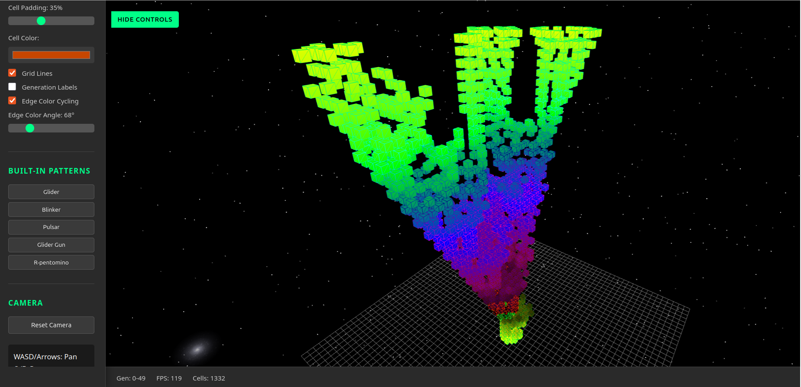

# [GameOfLife3D](https://www.hybridmachine.com)

A browser-based 3D visualization of Conway's Game of Life. Watch cellular automata evolve through time as a stunning three-dimensional structure, with each generation stacked vertically in 3D space.


*R-Petomino pattern with edge color cycling enabled, showing 49 generations*

## Features

- **3D Time Visualization**: Each generation renders in the X-Y plane with the Z-axis representing time progression
- **Interactive Camera**: Full orbit, pan, zoom controls via mouse, keyboard, and touch
- **Built-in Patterns**: Glider, Blinker, Pulsar, Gosper's Glider Gun, and R-pentomino
- **Custom Pattern Support**: Load patterns in RLE (Run-Length Encoded) format
- **Session Management**: Save and load complete sessions with all generations
- **Visual Customization**: Adjustable cell colors, padding, grid lines, and edge color cycling
- **Starfield Background**: Dynamic animated starfield with 5000 twinkling stars
- **Performance Optimized**: Handles grids up to 200x200 with 100+ generations at 30+ FPS

## Getting Started

### Prerequisites

- Node.js (with npm)
- A modern web browser with WebGL support (Chrome, Firefox, or Edge from 2022 or newer)

### Installation

```bash
# Clone the repository
git clone https://github.com/hybridmachine/ClaudeAssistedProjects.git
cd ClaudeAssistedProjects/GameOfLife3D

# Install dependencies
npm install
```

### Running the Application

```bash
# Build and start the development server (opens browser automatically)
npm run dev
```

The application will open at `http://localhost:8080`.

### Other Commands

```bash
# Build TypeScript to JavaScript
npm run build

# Watch mode (auto-recompile on changes)
npm run watch

# Start server only (assumes already built)
npm run serve

# Clean build artifacts
npm run clean
```

## Usage

1. **Select a Pattern**: Choose from built-in patterns or load a custom RLE file
2. **Set Generations**: Enter the number of generations to compute (1-1000)
3. **Compute**: Click "Compute Generations" to generate the 3D structure
4. **Explore**: Navigate through the 3D visualization using camera controls
5. **Customize**: Adjust visual settings like cell color, padding, and grid lines
6. **Save**: Export your session or patterns for later use

## Controls

### Keyboard

| Key | Action |
|-----|--------|
| W / Up Arrow | Pan forward |
| S / Down Arrow | Pan backward |
| A / Left Arrow | Pan left |
| D / Right Arrow | Pan right |
| Q | Rotate left around Y-axis |
| E | Rotate right around Y-axis |
| R | Move camera up |
| F | Move camera down |
| O | Orbit around Z-axis (counterclockwise) |
| P | Orbit around Z-axis (clockwise) |

### Mouse

| Action | Effect |
|--------|--------|
| Left-click drag | Orbit camera |
| Right-click drag | Pan camera |
| Scroll wheel | Zoom in/out |

### Touch (Mobile/Tablet)

| Gesture | Effect |
|---------|--------|
| Single finger drag | Orbit camera |
| Two finger drag | Pan camera |
| Pinch | Zoom in/out |

## Project Structure

```
GameOfLife3D/
├── src/
│   ├── main.ts              # Application entry point
│   ├── GameEngine.ts        # Game of Life computation engine
│   ├── Renderer3D.ts        # Three.js rendering system
│   ├── CameraController.ts  # Camera controls (keyboard/mouse/touch)
│   ├── UIControls.ts        # UI event handling
│   └── PatternLoader.ts     # RLE format parsing and patterns
├── dist/                    # Compiled JavaScript (generated)
├── index.html               # Main HTML file
├── styles.css               # Application styles
├── package.json             # Dependencies and scripts
└── tsconfig.json            # TypeScript configuration
```

## Built-in Patterns

| Pattern | Description |
|---------|-------------|
| **Glider** | Simple spaceship that travels diagonally across the grid |
| **Blinker** | Period-2 oscillator (simplest oscillator) |
| **Pulsar** | Period-3 oscillator with beautiful symmetry (13x13) |
| **Glider Gun** | Gosper's Glider Gun - produces infinite stream of gliders |
| **R-pentomino** | Methuselah pattern that evolves for 1103+ generations |

## File Formats

### RLE Pattern Format

The application supports the standard Run-Length Encoded (RLE) format for Game of Life patterns:

```
#N Pattern Name
#C Comment line
x = 3, y = 3, rule = B3/S23
bo$2bo$3o!
```

### Session Format (JSON)

Sessions are saved as JSON files containing:
- Grid dimensions
- All computed generations
- Cell states for each generation

## Technologies

- **TypeScript** - Type-safe JavaScript
- **Three.js** - WebGL-based 3D graphics
- **HTML5/CSS3** - User interface
- **http-server** - Development server

## Performance Notes

- Recommended maximum grid size: 200x200
- Recommended maximum simultaneous generations: 100
- Uses InstancedMesh for efficient rendering of thousands of cubes
- Supports frustum culling for off-screen cells

## Browser Support

- Chrome (2022+)
- Firefox (2022+)
- Edge (2022+)

Requires WebGL support.

## License

This project is part of the ClaudeAssistedProjects repository.

## Contributing

Contributions are welcome! Please read the `AGENTS.md` file for coding guidelines and development practices.
